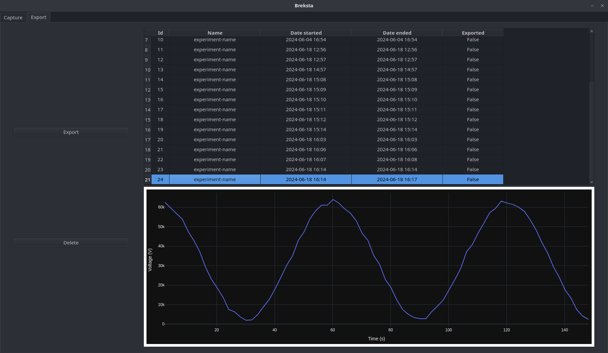

[](https://github.com/pre-commit/pre-commit)


- [Introduction](#introduction)
- [Features](#features)
- [App GUI examples](#app-gui-examples)
- [Pre-requisites](#pre-requisites)
- [Installation](#installation)
- [Contributing](#contributing)
- [Code Quality](#code-quality)
- [License](#license)
- [Funding](#funding)
- [Appendix](#appendix)

## Introduction

***Breksta*** is a data acquisition program that reads from photomultiplier tubes via the [ADS1115](https://www.adafruit.com/product/1085) ADC on a Raspberry Pi. It aims to simplify collecting, monitoring, and exporting photodiode/PMT data. The app can also operate in a simulated mode for testing.

## Features
- **Real-time charting** using `Plotly`.
- **Export functionality** that records experiment data for later analysis.
- **User interface** built with `PySide6` and integrated with `dash`/`plotly` for graphing.
- **Database integration** for storing experiment metadata (via `sqlalchemy`).
- **Mock device** for development and testing without dedicated hardware.

## App GUI examples

<details>
<summary>Data acquisition. Click to expand image</summary>


</details>
<details>
<summary>Data export. Click to expand image</summary>


</details>

## Pre-requisites

- **Linux-based OS** (tested on Manjaro, developed on Ubuntu)
- **Python `3.10`+** (tested on `3.11` and `3.12`)
- **Qt C++ libraries** for `PySide6`
- **Hardware**:
  - Raspberry Pi (tested on a 3/4, but any Pi with I2C support should work).
  - ADS1115 (address and gain configurable in the app).

## Installation

### Setup

1. Create and activate a Python environment:

    ```sh
    python3 -m venv .venv  # to create the environment
    source .venv/bin/activate  # to activate it
    ```

    Remember to activate your enviroment before runtime or development tasks.

2. Install the runtime and development packages:

    ```sh
    pip install -r requirements.txt       # Runtime dependencies
    pip install -r requirements-dev.txt   # Development dependencies (optional)
    ```

### Running the Application

To run the application, from the root of the project activate the virtual environment and run:

```bash
source .venv/bin/activate  # ensure the environment is active
python -m app.breksta
```

By default, the application will attempt to detect the ADS1115 ADC. If your hardware is set up and recognized, it will be available to start monitoring automatically.

### Selecting mock device for testing

If you do not have access to hardware or simply wish to test the application with fake data, set the following environment variable before running:

```sh
export USE_MOCK_DEVICE=1
```

This will generate a sine-wave signal in place of real ADC data.

## Contributing

Contributions are welcome! Feel free to open an Issue or Pull Request for any improvements, bug fixes, or new features.

## Code Quality

The project uses:

- `flake8`, `pylint`, `ruff` for linting.
- `ruff` for formatting.
- `pytest` (plus `coverage`) for tests.
- `mypy` for static typing checks.
- `pre-commit` to automatically run checks on `git` commit and push.

For more usage details, see [TOOLING.md](./docs/TOOLING.md).

## License

This project is licensed under the [Apache v2.0](./LICENSE) license.

## Funding

***Breksta*** was developed by the [**IT Research Department**](https://www.qmul.ac.uk/its/its-research/) [**RSE team**](https://blog.hpc.qmul.ac.uk/what-is-the-itsr-rse-team/), which also provided the funding and resources necessary to bring this project to life. Sincere gratitude goes out to the entire department for their ongoing support.

## Appendix

### ADC Integration

For detailed steps on enabling I2C on a Raspberry Pi, installing the modified ADS1x15 library, and troubleshooting permissions, see [adc_integration.md](./docs/adc_integration.md).
